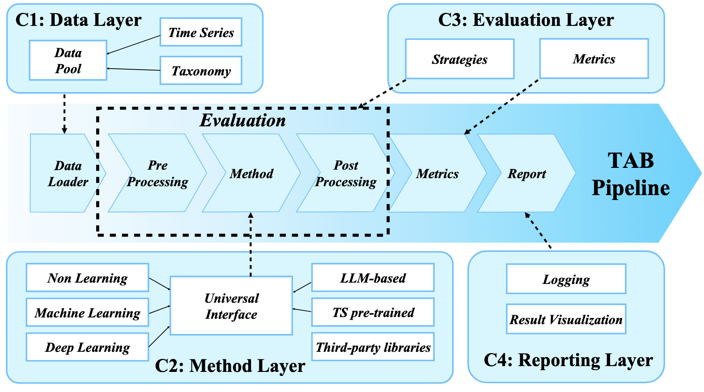
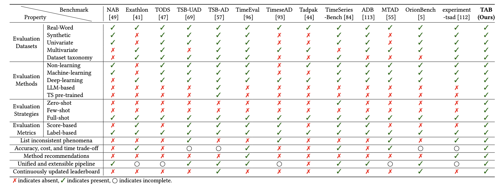

# TAB: Unified Benchmarking of Time Series Anomaly Detection Methods


## Table of Contents

1. [Introduction](#introduction)

1. [Quickstart](#Quickstart)

1. [Time series characteristics](#Time-series-characteristics)

1. [Full results](#Full-results)

   


## Introduction

TAB is an open-source library designed for time series anomaly detection researchers.

We provide a clean codebase for end-to-end evaluation of time series anomaly detection models, comparing their performance with baseline algorithms under various evaluation strategies and metrics.

The below figure provides a visual overview of TAB's pipeline.

<div align="center">
    
</div>


The table below provides a visual overview of how TAB's key features compare to other libraries for time series anomaly detection.

<div align="center">
    
</div>


## Quickstart

### Installation
Follow the steps below to configure the TAB environment.
#### 1. Install Git
Some models require Git to run. Please ensure that Git is installed on your system. If not, you can install it using the following command:
```shell
apt-get install git
```
#### 2. Download and Extract Environment
Download the environment from [Google Drive](https://drive.google.com/file/d/1HpvlzGWw1T8cxGR1vT081kzKYGZFpvWK/view?usp=sharing). (This may take some time, please wait patiently.) Then, create a directory my_env (we recommend creating it under `conda/envs/`) and extract the environment into this directory:
```shell
mkdir -p my_env
tar -xzf tab.tar.gz -C my_env
```
#### 3. Activate the Environment
```shell
source my_env/bin/activate
```
#### 4. Clean Environment Prefix
You can clear the environment prefix using the following command. Now the environment is the same as one created directly with conda at this path.
```shell
(my_env) $ conda-unpack
```

### Data preparation

Prepare Data. You can obtain the well pre-processed datasets from [Google Drive](https://drive.google.com/file/d/1vaFzhPpK2ALNLggISawXA9gjNiyd8nRG/view?usp=sharing). Then place the downloaded data under the folder `./dataset`. 


### Data preparation

Prepare Data. You can obtain the well pre-processed datasets from [Google Drive](https://drive.google.com/file/d/1_aW2AYwXtGk7ArjDjcSazqD0N9zp-zXx/view?usp=sharing). Then place the downloaded data under the folder `./dataset`. 

### Checkpoints preparation
You can download the checkpoints from [Google Drive](https://drive.google.com/file/d/14VKcv_sIPDJgSgzOxUIN80kAzqXdzhC0/view?usp=sharing). After obtaining the files, follow the steps below to organize them:
1. For LLM-based models, move the files from `checkpoints/llm_checkpoints` to the folder `ts_benchmark/baselines/LLM/checkpoints`.
2. For pre-train models (UniTS, Timer and TimesFM), move the files from `checkpoints/pre_train_checkpoints` to the folder `ts_benchmark/baselines/pre_train/checkpoints`. And the other models' checkpoints can be obtained from Huggingface by the code.


Ensure the files are placed in the correct directories for proper functionality.

### Train and evaluate model

We provide the experiment scripts for all benchmarks under the folder `./scripts/multivariate_detection`, and `./scripts/univariate_detection`. For example, you can reproduce an experiment result as the following:

```shell
sh ./scripts/multivariate_detection/detect_label/MSL_script/ModernTCN.sh
```


## Time series characteristics

We provide [code](./TAB_Characteristics_Extractor.zip) and [pseudocode](./docs/time_series_characteristics.md) for five characteristics used in TAB. 


## Full results

You can get the results from here:

- [Multivariate dataset results](./docs/results/TAB%20multivariate%20dataset%20result.pdf)
- [Univariate dataset results](./docs/results/TAB%20univariate%20dataset%20result.pdf)
