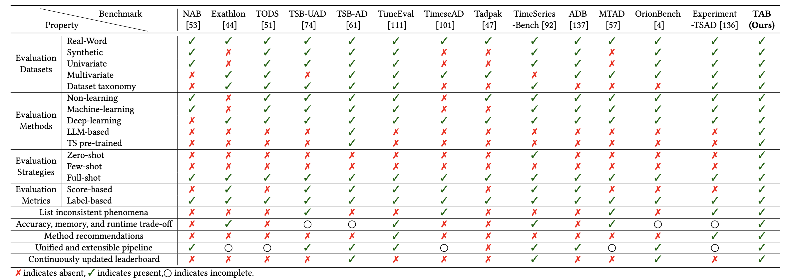

# TAB: Unified Benchmarking of Time Series Anomaly Detection Methods

[](https://arxiv.org/pdf/2403.20150.pdf)  [](https://www.python.org/)  [](https://pytorch.org/)    


> [!IMPORTANT]
> If you find this project helpful, please don't forget to give it a ⭐ Star to show your support. Thank you!


🚩 **News** (2025.05) **[TAB](https://arxiv.org/pdf/2506.18046) has been accepted by PVLDB 2025**.


## Table of Contents

1. [Introduction](#introduction)

1. [Quickstart](#Quickstart)

1. [FAQ](#FAQ)

1. [Citation](#Citation)

1. [Acknowledgement](#Acknowledgement)

1. [Contact](#Contact)

   

## Introduction

TAB is an open-source library designed for time series anomaly detection researchers.

We provide a clean codebase for end-to-end evaluation of time series anomaly detection models, comparing their performance with baseline algorithms under various evaluation strategies and metrics.

The below figure provides a visual overview of TAB's pipeline.

<div align="center">
    
</div>


The table below provides a visual overview of how TAB's key features compare to other libraries for time series anomaly detection.

<div align="center">
    
</div>


## Quickstart

> [!IMPORTANT]
>
> this project is fully tested under python 3.8, it is recommended that you set the Python version to 3.8.

1. Installation:

Given a python environment (**note**: this project is fully tested under **python 3.8**), install the dependencies with the following command:

```shell
pip install -r requirements.txt
```

2. Data preparation

Prepare Data. You can obtain the well pre-processed datasets from [Google Drive](https://drive.google.com/file/d/1V5BAHWBKU8uih3hE1R7WdF6_crZlIbQT/view?usp=drive_link). Then place the downloaded data under the folder `./dataset`.  

3. Checkpoints preparation

You can download the checkpoints from [Google Drive](https://drive.google.com/file/d/14VKcv_sIPDJgSgzOxUIN80kAzqXdzhC0/view?usp=sharing). After obtaining the files, follow the steps below to organize them:
1. For LLM-based models, move the files from `checkpoints/llm_checkpoints` to the folder `ts_benchmark/baselines/LLM/checkpoints`.
2. For pre-train models (UniTS, Timer and TimesFM), move the files from `checkpoints/pre_train_checkpoints` to the folder `ts_benchmark/baselines/pre_train/checkpoints`. And the other models' checkpoints can be obtained from Huggingface by the code.


Ensure the files are placed in the correct directories for proper functionality.

4. Train and evaluate model

We provide the experiment scripts for all benchmarks under the folder `./scripts/multivariate_detection`, and `./scripts/univariate_detection`. For example, you can reproduce an experiment result as the following:

```shell
sh ./scripts/CATCH.sh
```


## FAQ

1. Is there code in TFB's code base to compute the characteristics of the dataset?

TFB has open-sourced the [code](https://github.com/decisionintelligence/TFB/blob/master/characteristics_extractor/Characteristics_Extractor.py) for computing time series characteristics, such as trend, seasonality, stationarity, shifting, transition, correlation, and more. Both [Chinese](https://github.com/decisionintelligence/TFB/blob/master/characteristics_extractor/Readme_chn.md) and [English](https://github.com/decisionintelligence/TFB/blob/master/characteristics_extractor/Readme_en.md) documentation are provided.


## Citation

If you find this repo useful, please cite our paper.

```
@inproceedings{qiu2025tab,
title      = {{TAB}: Unified Benchmarking of Time Series Anomaly Detection Methods},
author     = {Xiangfei Qiu and Zhe Li and Wanghui Qiu and Shiyan Hu and Lekui Zhou and Xingjian Wu and Zhengyu Li and Chenjuan Guo and Aoying Zhou and Zhenli Sheng and Jilin Hu and Christian S. Jensen and Bin Yang},
booktitle  = {Proc. {VLDB} Endow.},
year       = {2025}
}


@inproceedings{wu2025catch,
title     = {{CATCH}: Channel-Aware multivariate Time Series Anomaly Detection via Frequency Patching},
author    = {Wu, Xingjian and Qiu, Xiangfei and Li, Zhengyu and Wang, Yihang and Hu, Jilin and Guo, Chenjuan and Xiong, Hui and Yang, Bin},
booktitle = {ICLR},
year      = {2025}
}
```


## Acknowledgement

The development of this library has been supported by **Huawei Cloud**, and we would like to acknowledge their contribution and assistance.


## Contact

If you have any questions or suggestions, feel free to contact:

- [Xiangfei Qiu](https://qiu69.github.io/) (xfqiu@stu.ecnu.edu.cn)
- [Xingjian Wu](https://ccloud0525.github.io/) (xjwu@stu.ecnu.edu.cn)


Or describe it in Issues.

We invite you to join the OpenTS community on WeChat. We run a group chat on WeChat, and you can get the access by scanning the [QR code](./docs/figures/QR.png). By joining the community, you can get the latest updates on OpenTS, share your ideas, and discuss with other members.

Those who wish to join can first scan the [QR code](./docs/figures/QR.png) to contact me via WeChat. Please **include your name and research direction in the remarks** when adding me. After your application is approved, we will invite you to join the group. Once you are in the group, please update your group nickname to **"Name + School/Institution + Research Direction."** Members who fail to update their remarks within a week will be regularly removed by the administrator.


